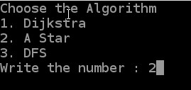
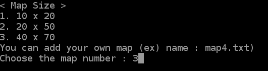
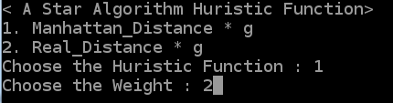
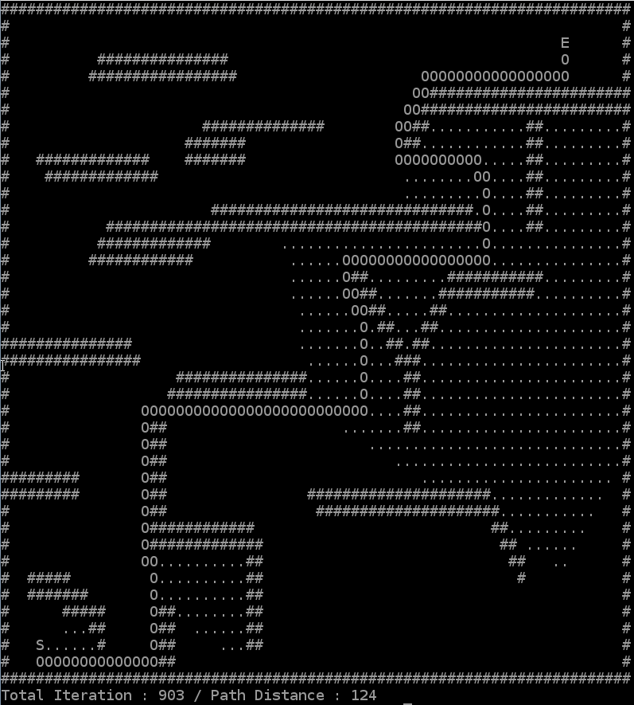
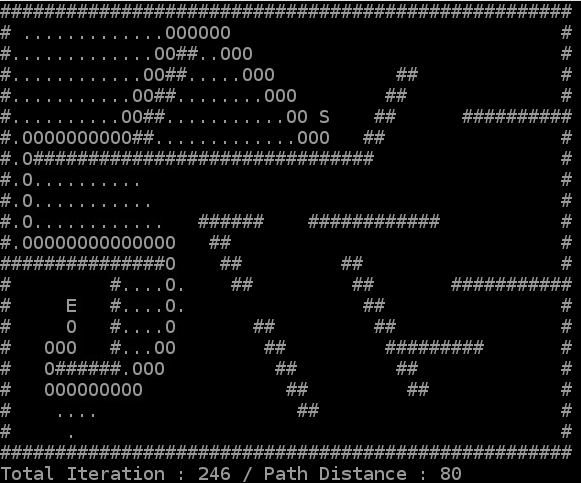
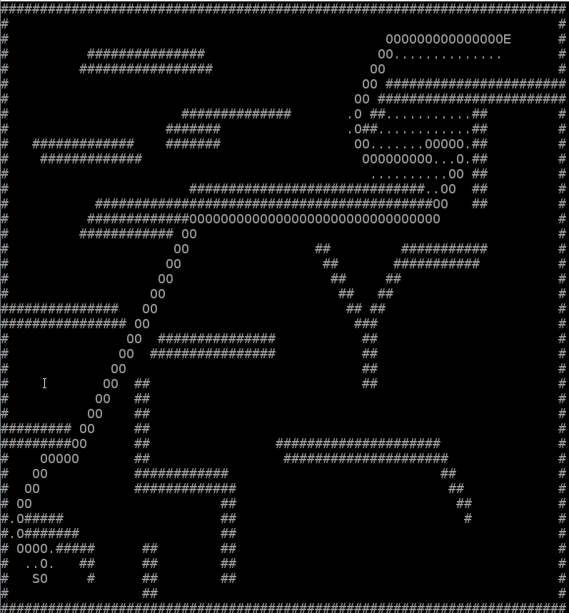
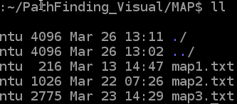
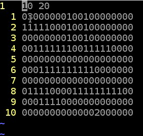

 # PathFinding_Visual

 ## 1. What is "PathFinding Visual"
 This program provides a visual representation of three algorithms that solve "PathFinding" problems.

Each algorithm is:
1. Dijkstra Algorithm
2. A_Star Algorithm
3. DFS (+ Huristic)

The execution screen is shown below.

 
 ## 2. How to Run 
2-1. Select the algorithm number to run first.

2-2. And determine the rate at which the execution screen of the algorithm will be displayed. The number entered at this time is in microseconds It is recommended that you enter 50000 on the first run.

2-3. Select the map to run the algorithm. There are three types of prepared maps, and you can add them in the future.

 ## 3. Execute A_Star Algorithm
If you run algorithm number 2, you must select the Huristic function of the A_Star algorithm to use.

Evaluation function of the A_Star function: 
    
    f(n)=g(n)+h(n) (f(n) : Evaluate Function, g(n) : Path Cost, h(n) : heuristic function)

There are two functions prepared.
1. Manhattan_Distance
2. Real Distance

Select the heuristic function to use, then enter the weight of the heuristic function. We recommend a value between 1 and 3 at the beginning. (If the weight is zero, the function will work just like Dijkstra Algorithm.)

The A_Star algorithm may not find the optimal path. Instead, the A_Star algorithm finds the appropriate path in a faster time.

 ## 4. Dijkstra Algorithm
 '~~~~~~~~~
 

 ## 5. DFS Algorithm
This DFS algorithm is a simple addition of the Heuristic technique to DFS.
For each search, first navigate in the direction closest to the target point.
(Surprisingly, most of the time, this function's performance was the best.)

 ## 6. How to add a Map
First, enter the MAP Directory. Then add the map according to how to name it.

Formats : map(num).txt

The rules for map00.txt are as follows:

6-1. The first start line is given the map size.

6-2. Meaning of each number : 

0 : Free space to pass, 1 : Walls that cannot passable, 2 : Starting point, 3 : Destination point
 
If there are errors such as multiple start points, Destination points, or incorrect map size, the program may not function normally.
